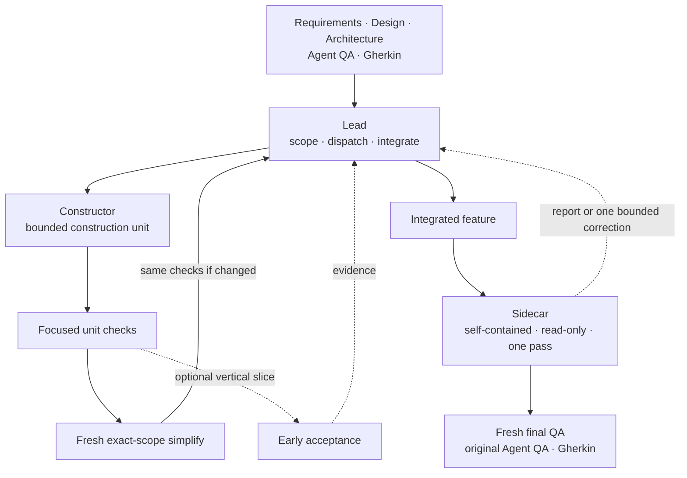

<p align="center">
  
</p>

<h1 align="center">Work Session</h1>

<p align="center"><strong>Keep substantial implementation work aligned from the first construction unit to final acceptance.</strong></p>

<p align="center">
  <strong>English</strong> · <a href="README.zh-CN.md">简体中文</a>
</p>

Work Session is not designed for routine tasks that amount to a few dozen lines. It is built for substantial implementation backed by detailed requirements, software design, acceptance criteria, and architecture rules. A long-running Lead keeps engineering progress aligned while bounded agents construct, simplify, review, and verify the result.

## Why Work Session?

- **Keep engineering work on course** — the Lead preserves the original contract, divides it into coherent construction units, coordinates dependencies, and integrates evidence without drifting from the design.
- **Build quality into every unit** — each unit receives checks proportional to its scope and a fresh exact-scope simplify pass. This avoids both redundant test churn and speculative defensive structures whose complexity would damage code quality more than the proven risk.
- **Audit without stopping construction** — an independent read-only Sidecar reviews self-contained current evidence outside the construction context. Its result is scheduled through the Lead, so advice cannot become a repeated development gate or reopen completed work without a proven current blocker.
- **Finish against the original definition of done** — final acceptance uses the Agent QA and Gherkin scenarios established at the start. Optional vertical slices can provide earlier acceptance evidence without changing the normal workflow.
- **Stay in control** — Work Session runs only when you explicitly invoke it.

## How it works



The Lead keeps later construction moving whenever interfaces and paths are stable. Simplification and focused checks scale with each construction unit rather than multiplying small-step tests. The Sidecar settles once before final QA: improvement advice is reported, while only a proven current blocker may trigger one bounded correction. If the design includes a vertical slice, the slice follows the same construction discipline and returns early acceptance evidence without disrupting the rest of the session.

## Quick Start

### Claude Code

Add the marketplace and install the Skill:

```text
/plugin marketplace add blankhoney/work-session
/plugin install work-session@work-session
```

Invoke it explicitly:

```text
/work-session:work-session
```

### Codex

Add the marketplace and install the Skill:

```bash
codex plugin marketplace add blankhoney/work-session
codex plugin add work-session@work-session
```

Invoke it explicitly:

```text
$work-session
```

Then describe the task and point to the existing requirement, design, architecture, and acceptance sources:

```text
Implement the checkout retry feature described in docs/checkout-retries.md.
Follow docs/architecture.md and use docs/checkout-retries.feature as final acceptance.
```

## Best for

- Substantial features or refactors spanning multiple files and stages
- Work with detailed requirements, software design, architecture rules, and explicit acceptance criteria
- Programs that benefit from bounded parallel construction and optional vertical-slice acceptance
- Changes that need independent audit without turning review into a recurring development gate
- Projects that must finish against their original Agent QA and Gherkin scenarios

For a few dozen routine lines, a typo, or a tiny one-file edit, the normal coding flow is usually enough.

## Platforms

| Platform | Explicit invocation |
| --- | --- |
| Claude Code | `/work-session:work-session` |
| OpenAI Codex | `$work-session` |

## License

[0BSD](LICENSE) — use, copy, modify, and distribute for any purpose, with no attribution requirement.
