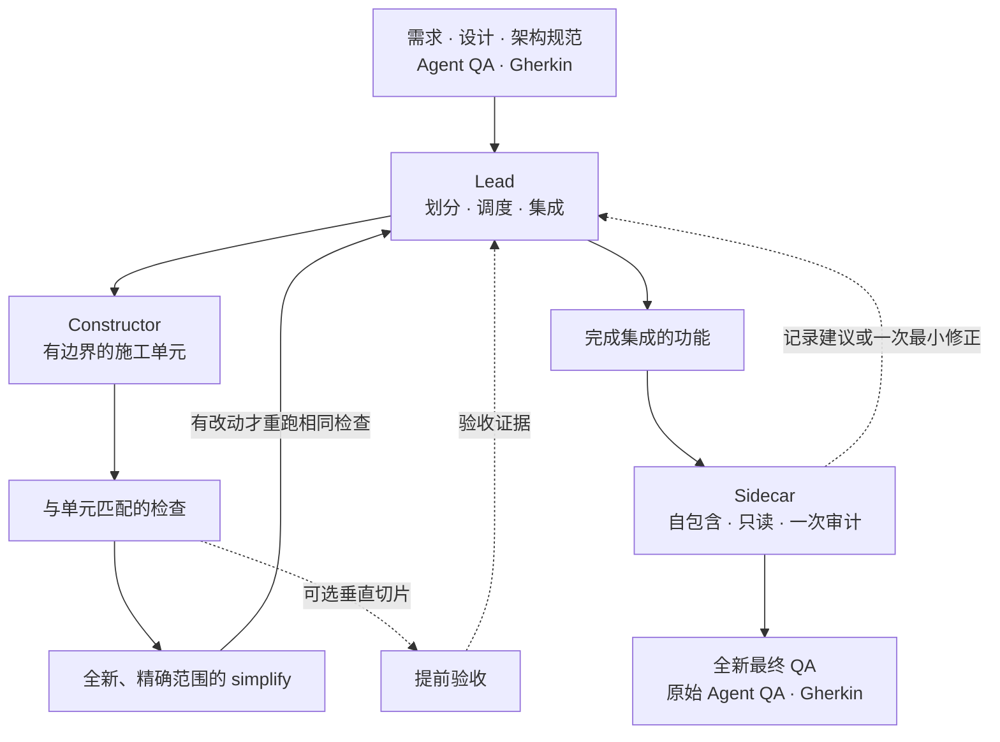

<p align="center">
  
</p>

<h1 align="center">Work Session</h1>

<p align="center"><strong>让复杂工程从第一个施工单元到最终验收始终沿着既定目标推进。</strong></p>

<p align="center">
  <a href="README.md">English</a> · <strong>简体中文</strong>
</p>

Work Session 不是为几十行常规小代码设计的。它面向拥有详细需求、程序设计文档、验收标准和架构规范的完整工程实现。一个长期运行的 Lead 负责保持工程方向，由边界清晰的 Agent 完成施工、简化、审计和验收。

## 为什么使用 Work Session？

- **保证工程进度不偏移** — Lead 持续维护最初的任务合同，把工作拆成连贯的施工单元，协调依赖并依据证据完成集成，避免实现逐渐偏离设计。
- **在每个施工单元内建立质量** — 每个单元都会获得与范围匹配的检查和一次全新、精确范围的 simplify。这样既避免重复测试造成空转，也避免用夸大风险的防御性结构增加复杂度、损害代码质量。
- **审计但不打断施工** — 独立只读 Sidecar 只接收自包含的当前证据，不继承施工聊天上下文。审计结果由 Lead 调度，因此建议不会变成反复触发的开发门禁，也不会在没有当前真实阻塞时重新打开已经完成的代码。
- **按照最初的完成标准收口** — 最终验收使用任务开始时确定的 Agent QA 和 Gherkin 场景。你也可以设计垂直切片提前获得可验收结果，而不改变 Work Session 的正常工作方式。
- **始终由你控制** — 只有显式调用时，Work Session 才会运行。

## 工作方式



只要接口和路径稳定，Lead 就会继续调度后续施工，不让旁路工作占据全局关键路径。Simplify 和检查按施工单元大小执行，而不是机械增加小步骤测试。Sidecar 在最终 QA 前完成一次收口：改进建议只记录，只有当前已证实的真实阻塞才允许一次有边界的最小修正。若设计中包含垂直切片，切片仍遵守同样的施工纪律，并把提前验收证据返回给 Lead，不会打断其余工作。

## 快速开始

### Claude Code

添加 Marketplace 并安装 Skill：

```text
/plugin marketplace add blankhoney/work-session
/plugin install work-session@work-session
```

显式调用：

```text
/work-session:work-session
```

### Codex

添加 Marketplace 并安装 Skill：

```bash
codex plugin marketplace add blankhoney/work-session
codex plugin add work-session@work-session
```

显式调用：

```text
$work-session
```

然后描述任务，并附上已有的需求、设计、架构和验收文件路径：

```text
实现 docs/checkout-retries.md 中描述的结账重试功能。
遵循 docs/architecture.md，并使用 docs/checkout-retries.feature 进行最终验收。
```

## 适合场景

- 跨多个文件和阶段的完整功能开发或重构
- 拥有详细需求、程序设计、架构规范和明确验收标准的工作
- 适合进行有边界并行施工，并可选择垂直切片提前验收的项目
- 需要独立审计，但不希望审查成为反复开发门禁的改动
- 必须按照最初 Agent QA 和 Gherkin 场景完成验收的项目

如果只是几十行常规代码、修正错别字或很小的单文件改动，普通编码流程通常已经足够。

## 支持平台

| 平台 | 显式调用方式 |
| --- | --- |
| Claude Code | `/work-session:work-session` |
| OpenAI Codex | `$work-session` |

## 许可证

[0BSD](LICENSE) — 可为任何目的使用、复制、修改和分发，无需署名。
