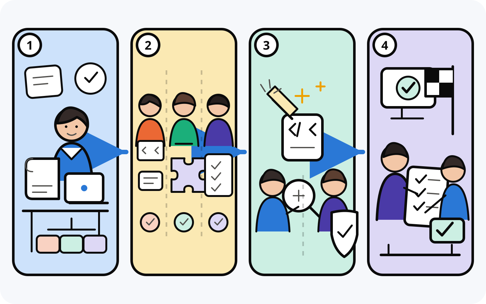

<h1 align="center">Work Session</h1>

<p align="center"><strong>一个 Lead，有边界的施工，独立审查，按原目标验收。</strong></p>

<p align="center">
  <a href="README.md">English</a> · <strong>简体中文</strong>
</p>

Work Session 是面向 Claude Code 与 Codex 的长任务编排 Skill。一个持续工作的 Lead 始终守住最初目标，再让范围明确的 Worker 分别完成施工、简化、审查和验收。

它适合有一定规模的工程实现，不适合错别字或很小的单文件改动。

## 为什么使用 Work Session？

- **长任务不跑偏** — 一个 Lead 从开始到结束持续连接需求、设计、代码和验收标准。
- **并行但不抢写** — 互不重叠的工作可以同时推进，但同一路径始终只有一个写入者。
- **施工与判断分开** — 全新 simplify、独立只读 Sidecar 和全新最终 QA，不让施工上下文替自己打分。
- **只在明确调用时运行** — Claude Code 与 Codex 都不会隐式启动 Work Session。

## 快速开始

### Claude Code

```text
/plugin marketplace add blankhoney/work-session
/plugin install work-session@work-session
```

安装后开启新会话，再显式调用：

```text
/work-session:work-session
```

### Codex

```bash
codex plugin marketplace add blankhoney/work-session
codex plugin add work-session@work-session
```

安装后开启新会话，再显式调用：

```text
$work-session
```

把已有任务资料的路径一起交给它：

```text
实现 docs/checkout-retries.md 中的结账重试功能。
遵循 docs/architecture.md，并用 docs/checkout-retries.feature 做最终验收。
```

## 工作方式

<p align="center">
  
</p>

### 第一步：理解并拆分

Lead 阅读任务资料、现有代码、项目规则和原始 QA，把目标拆成连贯、可以直接检查的工作单元，不额外发明需求。

### 第二步：分工施工

Worker 分别完成范围明确的施工单元。互不重叠的工作可以并行，但同一路径始终只有一个写入者，集成仍由 Lead 负责。

### 第三步：独立简化与审查

每个施工单元完成后，由全新、精确范围的 simplifier 做清理，其他安全工作不必等待。全部集成后，独立只读 Sidecar 对当前结果进行一次审查。

### 第四步：按原目标验收

全新 Tester 执行最初的验收对象。只有证据明确的失败才进入有边界的修正，随后由 Lead 收口并报告实际结果。

## 可选搭档 Skills

- **[`ponytail`](https://github.com/DietrichGebert/ponytail)** 可以推动最小且真正够用的实现，压住没有证据的复杂设计。
- **[`i-have-adhd`](https://github.com/ayghri/i-have-adhd)** 可以让进度、阻塞和下一步保持短、直接、容易扫读。

两者都完全可选，并由用户独立管理。Work Session 不会检查、安装、配置、启用或调用它们。

## 适合场景

- 跨多个文件和阶段的完整功能或重构
- 有需求、设计、架构规范或明确验收标准的工作
- 适合有边界并行施工，同时需要持续协调的任务
- 需要独立审查，并按最初目标做最终验收的改动

如果只是几十行常规代码，普通编码流程通常已经足够。

## 支持平台

| 平台 | 显式调用方式 |
| --- | --- |
| Claude Code | `/work-session:work-session` |
| Codex | `$work-session` |

## 许可证

[0BSD](LICENSE) — 可为任何目的使用、复制、修改和分发，无需署名。
